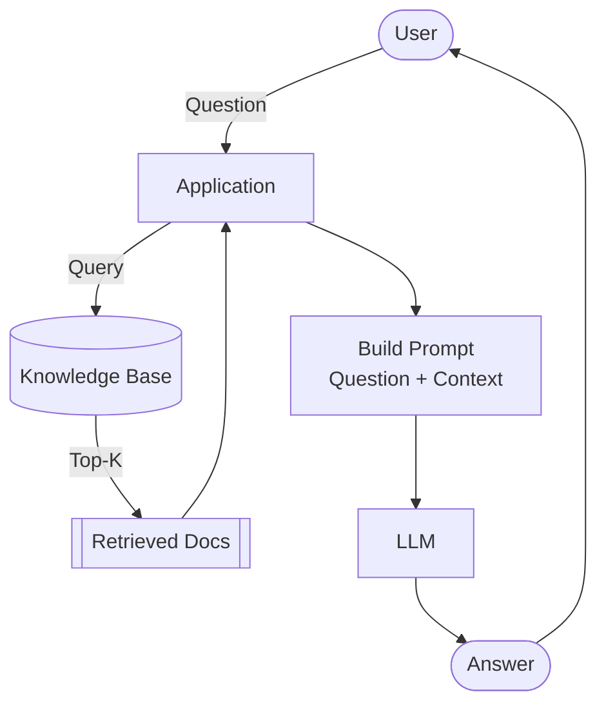
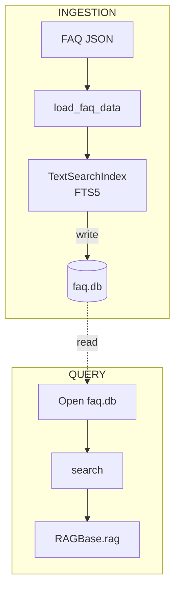
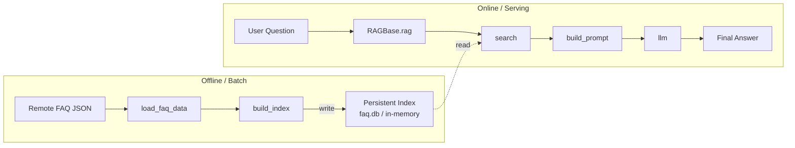

# Module 1, Part 1 — Agentic RAG Foundations

> **Source material:** LLM Zoomcamp 2026 · `01-agentic-rag` lessons 01–10 · workspace code (`ingest.py`, `rag_helper.py`, `app.py`) · personal synthesis notes.

---

## Table of Contents

1. [What RAG Means](#1-what-rag-means)
2. [Why RAG Exists](#2-why-rag-exists)
3. [The Core Mental Model](#3-the-core-mental-model)
4. [The Knowledge Base (FAQ Dataset)](#4-the-knowledge-base-faq-dataset)
5. [Data Ingestion with `ingest.py`](#5-data-ingestion-with-ingestpy)
6. [The Search Layer (minsearch)](#6-the-search-layer-minsearch)
7. [Prompt Engineering](#7-prompt-engineering)
8. [The LLM Call](#8-the-llm-call)
9. [Wiring the Pipeline: `rag()`](#9-wiring-the-pipeline-rag)
10. [From Scripts to OOP: The `RAGBase` Class](#10-from-scripts-to-oop-the-ragbase-class)
11. [Scope: Internal vs. External](#11-scope-internal-vs-external)
12. [Swappability, Modularity & the Agentic Future](#12-swaability-modularity--the-agentic-future)
13. [Persistent Ingestion (sqlitesearch)](#13-persistent-ingestion-sqlitesearch)
14. [End-to-End Data Flow](#14-end-to-end-data-flow)
15. [Study Questions](#15-study-questions)

---

## 1. What RAG Means

**Retrieval-Augmented Generation (RAG)** is a system design pattern that grounds an LLM’s generation in external, trusted data. Instead of relying solely on the model’s parametric memory, the system:

1. **Retrieves** relevant documents from a knowledge base.
2. **Augments** the LLM prompt with that retrieved context.
3. **Generates** a final answer grounded in the provided evidence.

The result is a system that answers from your data, not from the model’s training corpus.



**Key takeaway:** RAG does not make the model “smarter” in the abstract. It makes the answer more **accurate, relevant, and tied to your data**.

---

## 2. Why RAG Exists

Plain LLMs have three critical limitations that RAG addresses:

| Limitation | Description | RAG Solution |
|------------|-------------|--------------|
| **Knowledge cutoff** | The model only knows what was in its training data. | Inject fresh data at query time. |
| **No access to private data** | The model cannot see your documents, databases, or internal systems. | Retrieve from your own knowledge base. |
| **Hallucinations** | The model can produce confident-sounding but wrong answers. | Force it to answer from retrieved context only. |

In this module, the concrete problem is a course FAQ bot. Students ask questions like *“Can I still join after the course started?”* A plain LLM gives vague guesses. A RAG system finds the exact FAQ entry and generates a grounded answer.

**Quote from the lesson:**
> “RAG solves these problems by giving the LLM relevant documents at question time. We don’t hope the model memorized the answer. We retrieve the right information and hand it to the LLM.”  
> — [01-intro.md](https://github.com/DataTalksClub/llm-zoomcamp/blob/main/01-agentic-rag/lessons/01-intro.md)

---

## 3. The Core Mental Model

The best way to internalize RAG is the **open-book exam** analogy:

1. A student receives an exam question.
2. They open their notes and find the relevant page.
3. They read the notes.
4. They write an answer based on those notes.

In code:

- **The student** = the LLM.
- **The notes** = the search results.
- **The question** = the user’s query.
- **The answer** = the generated response.

Another framing: **Information Retrieval (IR)** finds the candidates, and **Generative AI** writes the final response. Neither is useful alone for this task.

---

## 4. The Knowledge Base (FAQ Dataset)

The course uses a public FAQ JSON corpus from `datatalks.club`. Each course has its own FAQ file with structured entries containing at least:

- `section` — topic grouping
- `question` — the user-facing question
- `answer` — the canonical answer
- `course` — the course identifier (e.g., `llm-zoomcamp`)

```json
{
  "section": "General Course-Related Questions",
  "question": "I just discovered the course. Can I still join?",
  "answer": "Yes, but if you want to receive a certificate...",
  "course": "llm-zoomcamp"
}
```

This structure matters because it maps directly to how the search index is configured: `question`, `section`, and `answer` are **text fields** (tokenized and ranked), while `course` is a **keyword field** (exact-match filter).

---

## 5. Data Ingestion with `ingest.py`

`ingest.py` is the **ETL** layer of the RAG system. It fetches raw data and converts it into a searchable index. It runs **offline / batch**, separate from the serving pipeline.

### `load_faq_data()`

```python
def load_faq_data():
    docs_url = "https://datatalks.club/faq/json/courses.json"
    response = requests.get(docs_url)
    courses_raw = response.json()

    documents = []
    url_prefix = "https://datatalks.club/faq"

    for course in courses_raw:
        course_url = f"""{url_prefix}{course["path"]}"""
        course_response = requests.get(course_url)
        course_response.raise_for_status()
        course_data = course_response.json()

        documents.extend(course_data)

    return documents
```

**What it does:**
1. Fetches a manifest of all courses (`courses.json`).
2. Iterates over each course and fetches its specific FAQ JSON file.
3. Flattens all entries into a single `documents` list.

### `build_index(documents)`

```python
def build_index(documents):
    index = Index(
        text_fields=["question", "section", "answer"],
        keyword_fields=["course"]
    )
    index.fit(documents)
    return index
```

**What it does:**
1. Instantiates a `minsearch.Index` with the field schema.
2. Calls `.fit(documents)` to tokenize and index everything in memory.
3. Returns the ready-to-search `index` object.

### Mental model
Think of this as **library organization**. It does not answer questions; it arranges the books so they can be found quickly and consistently.

---

## 6. The Search Layer (minsearch)

### Why search matters
With ~1,100 FAQ documents, sending them all to the LLM would be expensive, slow, and confusing. Search finds the top-`k` most relevant documents to send instead.

### How search works

Every search engine computes a similarity score between the query and each document, then returns the top results:

```python
score = sim(query, document)
```

In this module, `sim` is **lexical / text-based** (word overlap). Module 2 covers **vector / semantic** search (meaning-based similarity).

### minsearch configuration

```python
from minsearch import Index

index = Index(
    text_fields=["question", "section", "answer"],
    keyword_fields=["course"]
)
index.fit(documents)
```

- **`text_fields`** — Tokenized, ranked, BM25-like scoring.
- **`keyword_fields`** — Exact-match filtering (like `WHERE course = 'llm-zoomcamp'`).

### Boosting

Not all fields are equally important. The `question` field is usually the strongest signal.

```python
boost_dict = {"question": 3.0, "section": 0.5}
```

- `question: 3.0` → matches here count triple.
- `section: 0.5` → matches here count half.
- `answer: 1.0` → default weight.

This is the same mechanism used by Elasticsearch and Lucene.

### Filtering

```python
filter_dict = {"course": self.course}
```

Restricts results to a single course. Without it, you’d get answers mixed from all four Zoomcamp courses.

### Full search call

```python
def search(self, query, num_results=5):
    boost_dict = {"question": 3.0, "section": 0.5}
    filter_dict = {"course": self.course}

    return self.index.search(
        query,
        num_results=num_results,
        boost_dict=boost_dict,
        filter_dict=filter_dict
    )
```

**Why this design matters:** The contract is simple (`index.search(query, num_results, boost_dict, filter_dict)`). Any backend that implements this interface can be swapped in without touching the rest of the RAG logic.

---

## 7. Prompt Engineering

The prompt is the **bridge between search and the LLM**. A bad prompt lets the model ignore context and hallucinate; a good prompt keeps answers grounded.

### Two-part prompt architecture

Every prompt is split into:

1. **Instructions (system / developer message)** — Fixed, never changes. Tells the LLM how to behave.
2. **User prompt** — Changes every request. Carries the question and retrieved context.

### Instructions

```python
INSTRUCTIONS = """
Your task is to answer questions from the course participants
based on the provided context.

Use the context to find relevant information and provide accurate
answers. If the answer is not found in the context,
respond with "I don't know."
"""
```

This is what reduces hallucinations. The model is explicitly told its scope.

### User prompt template

```python
USER_PROMPT_TEMPLATE = """
Question:
{question}

Context:
{context}
"""
```

### Building the context string

```python
def build_context(self, search_results):
    lines = []
    for doc in search_results:
        lines.append(doc["section"])
        lines.append("Q: " + doc["question"])
        lines.append("A: " + doc["answer"])
        lines.append("")
    return "\n".join(lines).strip()
```

Turns a list of dictionaries into one readable text block. This is the **evidence package** the LLM reads before answering.

### Assembling the prompt

```python
def build_prompt(self, query, search_results):
    context = self.build_context(search_results)
    return self.prompt_template.format(
        question=query, context=context
    )
```

**Example output:**

```text
Question:
I just discovered the course. Can I join now?

Context:
General Course-Related Questions
Q: I just discovered the course. Can I still join?
A: Yes, but if you want to receive a certificate...

General Course-Related Questions
Q: Course: I have registered for the LLM Zoomcamp...
A: You don't need it. You're accepted...
```

---

## 8. The LLM Call

### The API surface

```python
def llm(self, prompt):
    input_messages = [
        {"role": "developer", "content": self.instructions},
        {"role": "user", "content": prompt}
    ]

    response = self.llm_client.responses.create(
        model=self.model,
        input=input_messages,
        max_output_tokens=1000
    )

    return response.output_text
```

### Why `responses.create`?

OpenAI has two APIs:
- **Chat Completions** — Legacy, widely cloned by other providers.
- **Responses API** — Newer, more convenient. Used in this course.

> **Portability note:** Groq, Gemini, and others expose an OpenAI-compatible client but only for `chat.completions`, not `responses`. If you switch providers, keep the OpenAI client but call `chat.completions` instead.

### Message roles

- `developer` — System-level instructions (how the LLM should behave).
- `user` — The actual prompt with question and context.

OpenAI accepts both `developer` and `system` for the instruction role; this course uses `developer`.

### Response structure

```python
response.output[0].content[0].text  # verbose path
response.output_text                # shortcut
```

### Token usage & cost

```python
response.usage
# ResponseUsage(input_tokens=334, output_tokens=39, total_tokens=373)
```

For `gpt-5.4-mini`:
- Input: $0.75 / 1M tokens
- Output: $4.50 / 1M tokens

A full RAG query typically costs **under $0.01**.

---

## 9. Wiring the Pipeline: `rag()`

The orchestrator method ties every piece together:

```python
def rag(self, query):
    search_results = self.search(query)
    prompt = self.build_prompt(query, search_results)
    answer = self.llm(prompt)
    return answer
```

**Execution trace for `rag("Can I join now?")`:**

1. `search()` runs the boosted, filtered query against `self.index`.
2. `build_prompt()` formats the top-`k` docs into the context block.
3. `llm()` sends the `developer` + `user` messages to the provider.
4. Final text is returned to the caller.

This is the **public API surface** of the class. Future agents call this method without caring about the internals.

---

## 10. From Scripts to OOP: The `RAGBase` Class

### The problem with globals

In notebooks, it’s tempting to write:

```python
index = build_index(documents)
openai_client = OpenAI()

def rag(query):
    ...
```

If you move `rag()` to a separate file, `index` and `openai_client` are no longer in scope. Importing them back creates tight coupling. The code becomes fragile and impossible to test.

### The solution: dependency injection

Wrap everything in a class. Dependencies are passed into the constructor.

```python
class RAGBase:
    def __init__(
        self,
        index,
        llm_client,
        instructions=INSTRUCTIONS,
        prompt_template=USER_PROMPT_TEMPLATE,
        course="llm-zoomcamp",
        model="nvidia/nemotron-3-ultra-550b-a55b:free"
    ):
        self.index = index
        self.llm_client = llm_client
        self.instructions = instructions
        self.course = course
        self.prompt_template = prompt_template
        self.model = model
```

**Parameters vs. Arguments:**
- **Parameters** are the placeholders in the function signature (`index`, `llm_client`).
- **Arguments** are the real objects passed at instantiation (`index=idx`, `llm_client=cli`).

### The OOP mental model (smartphone analogy)

| Concept | Analogy | Code example |
|---------|---------|--------------|
| **Class** | Blueprint | `class RAGBase:` |
| **Attributes** | Specifications / memory | `self.model`, `self.course` |
| **Methods** | Buttons / actions | `search()`, `llm()`, `rag()` |
| **Parameters** | Empty input slots | `query`, `num_results` |
| **Arguments** | Real input data | `"Can I join now?"` |

---

## 11. Scope: Internal vs. External

This is a critical gotcha when moving from notebooks to classes.

### Inside the class

```python
self.model = "gpt-4o"  # valid
```

### Outside the class

```python
assistant = RAGBase(index=index, llm_client=openai_client)
assistant.model = "gpt-4o"     # correct
self.model = "gpt-4o"          # NameError outside the class
answer = assistant.rag("Can I join now?")
```

**Rule:** `self` only exists inside the class. Outside, target the instance variable name directly.

---

## 12. Swappability, Modularity & the Agentic Future

### Why this architecture matters

Because `search` and `llm` depend entirely on `self.index` and `self.llm_client`, you can replace any backend without touching orchestration logic.

```python
# swap search backend
assistant = RAGBase(index=sqlite_index, llm_client=openai_client)

# swap LLM provider
assistant = RAGBase(index=index, llm_client=openrouter_client)

# swap prompt template
assistant = RAGBase(index=index, llm_client=cli, prompt_template=custom_template)
```

### State isolation

```python
zoomcamp_bot = RAGBase(index=idx, llm_client=cli, course="llm-zoomcamp")
mlops_bot    = RAGBase(index=idx, llm_client=cli, course="mlops-zoomcamp")
```

Both coexist without leaking data.

### Subclass extensibility

```python
class AdvancedAgent(RAGBase):
    def build_prompt(self, query, search_results):
        # override only the prompt logic
        ...
```

The rest of the pipeline (search, LLM call, orchestration) stays intact.

---

## 13. Persistent Ingestion (sqlitesearch)

### The problem with in-memory search

`minsearch` lives in a single process’s memory. When the process stops, the data disappears. Re-indexing on every restart is wasteful for large datasets.

### The solution: separate ingestion from querying

- **Ingestion process:** Fetches data once, writes to a persistent index (`faq.db`).
- **Query process:** Opens the existing index and searches it.



### Code

```python
from sqlitesearch import TextSearchIndex

# Ingestion
index = TextSearchIndex(
    text_fields=["question", "section", "answer"],
    keyword_fields=["course"],
    db_path="faq.db"
)
for doc in docs_llm:
    index.add(doc)
index.close()

# Querying (separate notebook / process)
sqlite_index = TextSearchIndex(
    text_fields=["question", "section", "answer"],
    keyword_fields=["course"],
    db_path="faq.db"
)
results = sqlite_index.search(query, num_results=5)
```

### Why SQLite?

- Ships with Python (no extra dependency).
- Has full-text search (FTS5) built in.
- `sqlitesearch` wraps FTS5 with the same API as `minsearch` — a true drop-in replacement.

### Scaling up

For production systems, the same pattern applies with heavier backends:

- Elasticsearch / OpenSearch
- Qdrant (vector database)
- Weaviate (vector database)

---

## 14. End-to-End Data Flow



**Trace a real query with your workspace code:**

1. `ingest.py` produces an `Index` (in-memory) or `faq.db` (persistent).
2. `RAGBase(index, llm_client)` stores it as `self.index`.
3. User calls `rag("Can I join now?")`.
4. `search()` filters by `self.course` (`llm-zoomcamp`) and boosts `question` field (`3.0`).
5. `build_context()` stringifies top-`k` docs into `section | Q: ... A: ...` blocks.
6. `build_prompt()` interpolates `{question}` and `{context}` into `USER_PROMPT_TEMPLATE`.
7. `llm()` sends `developer` + `user` messages to the provider.
8. Final text is returned.

---

## 15. Study Questions

Use these for active recall and self-testing:

1. What problem does RAG solve that a plain LLM cannot?
2. Why does the model need retrieval instead of only generation?
3. What is the role of `ingest.py` in the system lifecycle?
4. What is the role of `rag_helper.py` in the system lifecycle?
5. What is the difference between `text_fields` and `keyword_fields` in minsearch?
6. Why are `boost_dict` and `filter_dict` used together?
7. What is the purpose of the `developer` message role?
8. Why is `response.output_text` preferred over `response.output[0].content[0].text`?
9. What problem do constructor arguments solve that globals created?
10. What parts of `RAGBase` can be swapped later without rewriting the orchestrator?
11. What is the difference between the offline ingestion pipeline and the online query pipeline?
12. When should you use `minsearch` vs. `sqlitesearch`?

---

## References

- [Module 1 Lessons (main repo)](https://github.com/DataTalksClub/llm-zoomcamp/blob/main/01-agentic-rag/lessons/01-intro.md)
- [RAG Lesson (video)](https://www.youtube.com/watch?v=JktYwBIDErk&list=PL3MmuxUbc_hLZFNgSad56pDBKK8KO0XIv)
- [RAG Helper Lesson (video)](https://www.youtube.com/watch?v=JxaC6Hrym6c&list=PL3MmuxUbc_hLZFNgSad56pDBKK8KO0XIv)
- [minsearch](https://github.com/alexeygrigorev/minsearch)
- [sqlitesearch](https://github.com/alexeygrigorev/sqlitesearch)
- [NVIDIA NIM Docs](https://docs.nvidia.com/nemo/agent-toolkit/1.1/workflows/using-local-llms.html)
